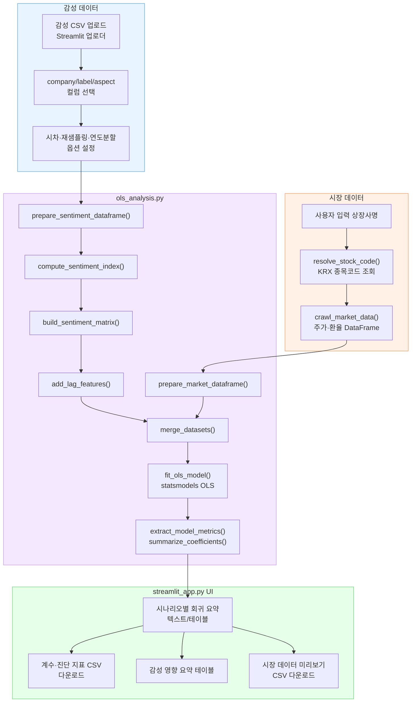

# OLS 분석 단계 작업 정리

## 개요
- 삼성전자·SK하이닉스 뉴스 기반 감성·토픽 지표와 시장 데이터를 결합해 OLS 회귀를 수행하는 단계의 전체 흐름을 구현했다.
- 구성 요소는 **시장 데이터 수집(`crawl_market_data.py`) → 회귀 백엔드(`ols_analysis.py`) → Streamlit UI(`streamlit_app.py`)**로 나뉜다.
- 사용자는 Streamlit 화면에서 감성 CSV 업로드, 분석 대상 회사 지정, 회귀 파라미터 선택, 결과 확인/다운로드까지 한 번에 수행할 수 있다.
- 목표는 정확한 시장 데이터 수집, 감성 지표와 주가 데이터를 결합한 회귀 분석, 그리고 Streamlit UI를 통한 실사용자 인터페이스 제공이다.

## 파일별 요약
- `crawl_market_data.py`: KRX 상장사 목록을 기반으로 주가·환율 데이터를 수집하고 병합하는 데이터 소스 계층이다.
- `ols_analysis.py`: 감성 지수 생성, 시장 데이터 전처리, 병합, 시차 변수 생성, OLS 회귀 적합과 결과 요약을 담당한다.
- `streamlit_app.py`: 사용자 UI 계층으로, 입력 파라미터를 받아 시장 데이터 수집 및 회귀 실행을 orchestration하고 결과를 시각화/다운로드 기능과 함께 제공한다.

## 아키텍처 다이어그램
아래는 모듈 간 데이터 흐름을 ASCII 다이어그램으로 나타낸 것이다.

```
┌───────────────────────┐          ┌─────────────────────────┐
│   감성 CSV 업로드      │           │   시장 데이터 조회       │
│   (streamlit_app.py)  │          │   (crawl_market_data.py)│
└─────────────┬─────────┘          └──────────────┬──────────┘
              │                                   │
              │ 감성 데이터                       │ 주가·환율 DataFrame
              │                                   │
              ▼                                   ▼
┌───────────────────────────────────────────────────────────────┐
│                 OLS 백엔드 처리 (ols_analysis.py)             │
│  - 감성 지수 산출 및 매트릭스 생성                           │
│  - 시차 변수/재샘플링/연도분할 옵션 적용                      │
│  - 시장 데이터와 날짜 기준 병합                               │
│  - statsmodels OLS 적합 및 요약/진단/계수 산출                │
└─────────────┬──────────────────────────────────────────────────┘
              │ 회귀 결과 (summary, diagnostics, coefficients)
              ▼
┌───────────────────────────────────────────────────────────────┐
│              Streamlit UI 결과 표시 (streamlit_app.py)        │
│  - 시나리오별 회귀 요약/지표/계수 테이블 및 다운로드 버튼     │
│  - 감성 영향 요약, 시장 데이터 미리보기/CSV 다운로드          │
└────────────────────────────────────────────────────────────────┘
```

### Mermaid 다이어그램 (노션 붙여넣기용)
아래 코드를 복사해 노션 코드블록(언어: Mermaid)에 붙여넣으면 다이어그램이 생성된다.



## 아키텍처 및 데이터 플로우
1. **입력 데이터**
   - 감성 CSV: `date`, `company`, `label`, `aspect_category`, `predicted_sentiment` 등 감성/토픽 정보 포함.
   - 시장 데이터: FinanceDataReader로 KRX 종목 일별 시세 및 USD/KRW 환율 조회.
2. **전처리/집계**
   - 감성 데이터는 `label`·`aspect_category`별로 긍/부정 수를 집계하고 감성 지수(가중치)를 산출한다.
   - 시장 데이터는 `daily_return`, `환율증감률` 등의 파생변수를 생성한다.
3. **데이터 병합**
   - 날짜 기준으로 감성 지수 매트릭스와 시장 데이터를 내부 결합.
   - 사용자 요청 시 시차(Lag) 변수, 재샘플링, 연도 분할 등의 변환을 적용.
4. **회귀 분석**
   - Statsmodels OLS를 사용해 종속변수(`daily_return`)와 감성·토픽 파생 변수 간 관계를 추정.
   - 단순 회귀(1개 변수)와 다중 회귀(복수 변수)를 선택적으로 지원.
5. **결과 출력**
   - 회귀 요약 텍스트, 계수표, 진단 지표, 감성 효과 요약을 표/다운로드 버튼으로 제공.
   - 조회한 시장 데이터도 확인 및 CSV 저장 가능.

## 모듈별 상세

### `crawl_market_data.py`
| 함수 | 주요 기능 | 파라미터 |
| --- | --- | --- |
| `resolve_stock_code(company: str) -> (name, code)` | 입력된 상장사명/종목코드로 KRX 상장 목록에서 정확한 이름과 코드를 조회 | `company`: 회사명 또는 6자리 코드 |
| `fetch_stock_data(stock_code, start, end)` | 지정 구간의 일별 시세 데이터(KRX) 수집 | `stock_code`, `start`, `end` |
| `fetch_exchange_rate(start, end)` | USD/KRW 환율 데이터를 감가 | `start`, `end` |
| `crawl_market_data(company, start, end, save_path)` | 상장사명 → 종목코드 매핑 → 주가·환율 조회 후 병합, CSV 저장 옵션 제공 | `company`, `start`, `end`, `save_path` |
| `main()` | CLI 진입점. 인자로 받은 회사명·기간·저장경로로 크롤링 실행 | `--company`, `--start-date`, `--end-date`, `--output` |

- **설계 포인트**
  - 외부 입력을 그대로 사용하도록 영문/한글 자동 변환을 제거해 사용자가 원하는 명칭으로 조회할 수 있게 했다.
  - 종목코드 입력도 허용해 반복 실행 시 속도를 높일 수 있다.
  - 환율 데이터를 반드시 포함시켜 추후 회귀 분석에서 외부 변수로 활용 가능하도록 병합 구조를 고정했다.
  - 실패 시 명확한 예외 메시지를 출력해 UI/CLI 양쪽에서 오류 원인을 쉽게 파악한다.

### `ols_analysis.py`
주요 파이프라인은 `run_single_regression`과 `run_regression_scenarios_from_frames`.

- **입력 파라미터**
  - `sentiment_csv` / `sentiment_df`: 감성 데이터 경로 또는 DataFrame
  - `market_csv` / `market_df`: 시장 데이터 경로 또는 DataFrame
  - `flag_column` 또는 `filter_column`/`filter_values`: 회귀 대상 회사 지정 방식
  - `feature_columns`: 사용할 감성 지수 컬럼 목록 (없으면 전체 사용)
  - `lag_periods` / `lag_target_columns`: 시차 변수 생성 설정
  - `start` / `end`: 분석 기간 필터링
  - `split_year` / `resample_frequency`: 시나리오 확장 (연도 분할, 주간/월간 재샘플링)
  - `output_dir`, `export_sentiment_matrix`, `export_merged_data`: 중간/결과 파일 저장 옵션

- **핵심 로직**
  1. `prepare_sentiment_dataframe`: 감성 텍스트 라벨을 정수(-1/0/1)로 변환, 날짜 정규화.
  2. `compute_sentiment_index`: 날짜·라벨·측면 별 감성 지수를 계산, `label_aspect` 키 생성.
  3. `build_sentiment_matrix`: 감성 지수를 피벗해 날짜×지표 매트릭스로 변환.
  4. `add_lag_features`: 선택한 컬럼에 대해 지정된 시차 컬럼 생성.
  5. `prepare_market_dataframe`: `daily_return`, `환율증감률` 계산 및 날짜 정규화.
  6. `merge_datasets`: 감성 매트릭스와 시장 데이터를 날짜 기준 내부 결합.
  7. `fit_ols_model`: 감성 변수(및 시차 변수)로 종속변수(`daily_return`)를 설명하는 OLS 모델 적합.
  8. `extract_model_metrics`/`summarize_coefficients`: R², AIC, Durbin-Watson 등 진단값과 계수표 생성.

- **출력 구조**
  - `RegressionResult`: `summary`(텍스트), `coefficients`(DataFrame), `diagnostics`(DataFrame), `n_samples` 등 포함.
  - `run_regression_scenarios_from_frames`는 일별, 연도분할(이전/이후), 재샘플링 시나리오를 튜플 리스트로 반환.

- **CLI 사용**
  - `python ols_analysis.py --sentiment-csv ... --market-csv ... --filter-column company --filter-values 삼성전자`
  - 옵션으로 `--lag-periods 1 2`, `--lag-columns label1_aspectA` 등 시차 변수 생성 제어.
  - `--split-year 2025` 지정 시 전체/2024 이전/2025 이후 세 구간을 자동으로 분석.

### `streamlit_app.py`
Streamlit UI에서 전체 파이프라인을 제어.

- **주요 UI 요소와 파라미터**
  - 감성 CSV 업로더 (`st.file_uploader`)
  - 기간 필터 (`start_date`, `end_date`)
  - 연도 분할 옵션 (`split_year_enabled`, `split_year`)
  - 재샘플링 옵션 (`resample_option`: 없음/주간/월간)
  - 회귀 모드 (`단순 회귀`, `다중 회귀`)와 컬럼 선택 UI
  - 시차 변수 토글, 대상 컬럼/기간 선택 (`lag_enabled`, `lag_target_columns`, `lag_periods`)
  - 회사 선택 멀티셀렉트 및 결과 라벨/시장 조회용 이름 입력
  - 회귀 실행 및 종목 코드 조회 버튼

- **실행 흐름**
  1. 감성 CSV를 업로드하면 `company` 값을 기준으로 분석 대상 선택 UI를 제공.
  2. 회귀 모드와 시차 등 옵션을 설정하고 `회귀 분석 실행` 버튼을 누르면,
     - 선택된 회사마다 시장 데이터를 `crawl_market_data`로 수집.
     - `run_regression_scenarios_from_frames`를 호출해 일별/분할/재샘플링 회귀를 수행.
  3. 결과 출력
     - 시나리오별 회귀 요약(텍스트 + TXT 다운로드)
     - 요약 지표/계수 테이블 + CSV 다운로드
     - 감성 지수 영향 요약(계수의 부호, 유의성 표시)
     - 시장 데이터 미리보기 및 CSV 다운로드
  4. `선택한 회사 종목 코드 확인` 버튼은 입력된 상장사명 리스트를 순회하며 종목코드를 즉시 확인.

- **구조**
  - 업로드 단계 → 폼 입력 → 제출 처리(`submitted`) → 회귀 실행 루프 → 결과 출력으로 명확히 나눈다.
  - 다중 시나리오 결과를 일관된 UI 패턴으로 보여 주기 위해 `scenario_results`를 순회하며 공통 구성 요소 렌더링.
  - Lag 변수 선택 시 자동으로 생성한 컬럼명을 회귀에 반영하고, 사용자가 직접 선택한 시나리오에 맞춰 가공한다.

## 사용 시 유의 사항
- 감성 CSV에는 최소한 `date`, `company`, `label`, `aspect_category`, `sentiment` 또는 `predicted_sentiment` 컬럼이 존재해야 한다.
- `company` 값이 `Both`인 데이터는 Streamlit에서 특정 회사를 선택하면 자동으로 포함되도록 처리했다.
- 시장 데이터 조회 시 상장사명을 **한국거래소 등록 명칭 그대로** 입력해야 한다. 자동 영문 변환 등은 없다.
- 시차 변수를 사용할 경우 결측 제거로 표본 수가 크게 줄어들 수 있으므로 기간/라그 설정을 주의해야 한다.
- 회귀 결과는 Statsmodels OLS의 가정(정규성, 독립성 등)에 의존하므로 추가 진단이 필요할 수 있다.

## 요약
1. 감성 CSV 업로드 → 분석 대상 회사 선택 → 회귀 옵션 설정 → 회귀 실행.
2. 백엔드는 감성 지수 산출, 시장 데이터와의 병합, 시나리오별 OLS 실행을 책임진다.
3. 결과물은 Streamlit에서 표와 다운로드 버튼으로 제공되어 후속 보고서나 추가 분석에 즉시 활용할 수 있다.


