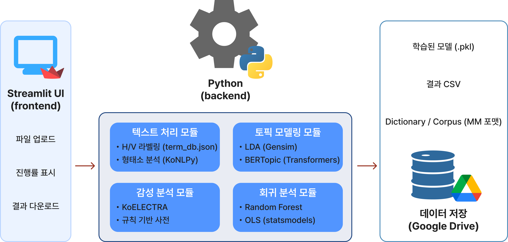

# 1팀 데이터 분석 Agent

## 1. 프로젝트 개요

- 프로젝트 명 : 데이터 분석 자동화 시스템
- 주요 기능 : 크롤링 → 전처리 → 토픽 라벨링 → 감성 라벨링 → 감성 분석 → 회귀 분석 → 대시보드

## 2. 시스템 아키텍처



## 3. 폴더 구조 및 역할

```jsx
Data_analysis_platform/
  ├─ **1.crawling/ # 데이터 수집**
        ├─ app_crawling.py           # 크롤링 UI
      └─ crawler.py                # 크롤링 모듈
  ├─ **2.data_preparation/ # H/V 라벨링**
        ├─ hv_labeling.py            # H/V 모듈
        ├─ hv_labeling_app.py        # H/V 라벨링 UI
      └─ term_db.json              # Term_db 사전 
  ├─ **3-1.lda/ # LDA 토픽 모델링**
        ├─ README_LDA.md             # LDA 관련 문서
        ├─ lda_app.py                # LDA UI
      └─ loa_local.py              # LDA 모듈
  ├─ **3-2.bertopic/ # BERTopic 모델링**
        ├─ README_BERTopic.md        # BERTopic 관련 문서
        ├─ bertopic_app.py           # BERTopic UI
      └─ bertopic_local.py         # BERTopic 모듈
  ├─ **4.sentiment/ # 감성 라벨링, 감성 분석**
        ├─ labeling_app.py           # 감성 라벨링 UI
        ├─ module_app.py             # 감성 분석 UI
        ├─ sentiment_absa.py         # 감성 분석 모듈
        ├─ sentiment_app.py          # 감성 라벨링 UI + 감성 분석 UI
        ├─ sentiment_dict.json       # 감성 사전
        ├─ sentiment_labeling.py     # 감성 라벨링 모듈
      └─ sentiment_module.py       # 감성 분석 모델 비교 모듈
  ├─ **5.ols/ # ols 회귀분석**
        ├─ crawl_market_data.py      # 주가 데이터 크롤링
        ├─ ols_analysis.py           # OLS 모듈
      └─ streamlit_app.py          # OLS UI
  ├─ main_app.py                   # 통합 실행 파일
  ├─ .env                          # API 키
  └─ requirements.txt
```

## 4. 파이프라인

## **4-1. 데이터 수집 (크롤링 API)**

### ✔ 입력

- Insightpage API 키
- 키워드: 삼성전자, SK하이닉스
- 기간: 2020~2025
- 페이지/문서 수

### ✔ 처리 흐름

```jsx
사용자 입력
  ↓
app_crawling.py
  • API 요청 생성
  • 페이지네이션 처리
  ↓
InsightPageAPI 클래스
  • 응답(JSON) → DataFrame 변환
```

### ✔ 출력

- Raw CSV (title, content, date, url, source, company)

## **4-2. H/V 라벨링**

### ✔ 입력

- 크롤링된 CSV
- Term DB(JSON): H/V 키워드

### ✔ 처리 흐름

```jsx
CSV 로드
  ↓
전처리 (title + content → sentence)
  ↓
키워드 매칭
  • V 키워드 카운트
  • H 키워드 카운트
  • 우선순위 적용 (V → H)
  ↓
필터링 (min_match 조건)
```

### ✔ 생성 컬럼

- `label` (H/V)
- `HV_type` (horizontal/vertical)
- `match_count`
- `aspect_term`, `aspect_category`

### ✔ 주요 파라미터

- min_matches=1
- label_priority=['V','H']
- default_label='H'
- remove_unknown=True

## **4-3. LDA 토픽 모델링**

### ✔ 입력

- H/V 라벨링된 CSV
- 토픽 개수: [5, 10, 15, 20]

### ✔ 처리 흐름

```jsx
데이터 로드
  ↓
형태소 분석 (Okt 명사 추출 + 불용어 제거)
  ↓
Dictionary / Corpus 생성
  ↓
LDA 학습 (passes=5, iterations=50)
  ↓
토픽 평가 (Coherence, Perplexity)
  ↓
문서별 dominant topic 할당
```

### ✔ 출력 컬럼

- `dominant_topic`
- `topic_prob`
- `topic_keywords`
- `all_topics`

## 4-4. BERTopic 모델링

### ✔ 입력

- H/V 라벨링된 CSV
- 임베딩 모델: ko-sroberta-multitask

### ✔ 처리 흐름

```jsx
임베딩 생성 (768차원)
  ↓
UMAP 차원 축소 (→ 5차원)
  ↓
HDBSCAN 클러스터링
  ↓
c-TF-IDF 기반 토픽 키워드 생성
  ↓
문서별 토픽 할당
```

### ✔ 출력 컬럼

- `topic` (번호 / -1 = outlier)
- `topic_keywords`
- `topic_name`
- `is_outlier`

## **4-5. 감성 라벨링**

### ✔ 입력

- 감성 라벨링 대상 CSV (`sentence` , `aspect`)
- 감성사전 JSON (`POS_BASE`, `NEG_BASE`, `ASPECT_POS`, `ASPECT_NEG`)
- 실행 옵션
    - 규칙 기반 라벨링 사용 여부
    - 모델 기반 라벨링 사용 여부
    - CONFIDENCE_THRESHOLD

### ✔ 처리 흐름

```jsx
토픽 모델링 CSV 로드
  ↓
감성사전(JSON) 로드
  ↓
규칙 기반 라벨링 수행 (키워드 매칭)
  ↓
감성 분류 모델 학습 (positive/negative)
  ↓
중립 문장에 대해 모델 예측 적용
  ↓
규칙 + 모델 결과 병합 (combined sentiment 결정)
  ↓
감성 라벨링 CSV 생성 및 표시
```

### ✔ 출력 컬럼

- `sentence`
- `aspect`
- `sentiment` (positive / negative / neutral)
- `sentiment_source` (rule / model / combined)
- `confidence` (모델 확률)

## **4-6. 감성 분석**

### ✔ 입력

- 감성 분석용 CSV (`sentence`, `sentiment`)
- 선택된 모델
    - 전통 ML: RF, SVM, NB
    - 딥러닝 HuggingFace : KoBERT, KoELECTRA, BERT, KoRoBERTa
- ABSA 모델 사용 여부

### ✔ 처리 흐름

```jsx
감성 라벨링 CSV 업로드
  ↓
모델 선택 (전통 ML / HF 모델)
  ↓
전통 ML → TF-IDF 기반 학습 및 성능 평가
  ↓
HuggingFace 모델 → fine-tuning 및 예측
  ↓
모델별 성능 비교 (accuracy, f1-score)
  ↓
모델 성능 DataFrame 생성 및 시각화 
  ↓
ABSA 모델 실행 (aspect 기반 감성 분석)
  ↓
감성 분석 CSV 생성
```

### ✔ 출력 컬럼

- `model_name`
- `accuracy`
- `f1_score`
- `train_time`
- ABSA 결과
    - `sentence`
    - `aspect`
    - `pred_label`
    - `confidence`

## **4-7. 회귀분석**

### ✔ 입력

- 감성 CSV (`date`, `company`, `label`, `aspect_category`, `sentiment`/`predicted_sentiment`)
- 시장 데이터 (KRX 종목 일별 시세, USD/KRW 환율)
- 분석 대상 회사 지정
- 회귀 옵션
    - 단순/다중 회귀
    - 시차(Lag) 변수 여부, 대상 컬럼, 기간
    - 연도 분할 옵션
    - 재샘플링 옵션 (주간/월간)

### ✔ 처리 흐름

```jsx
감성 라벨링 CSV 업로드
  ↓
분석 대상 회사 선택 / 기간·옵션 설정
  ↓
시장 데이터 수집 (crawl_market_data.py)
  - KRX 종목코드 조회
  - 주가, 환율 데이터 수집 및 병합
  ↓
감성 지수 계산 및 매트릭스 생성 (ols_analysis.py)
  - label/aspect 기준 집계
  - 시차 변수 생성 (선택 시)
  ↓
시장 데이터와 감성 매트릭스 날짜 기준 내부 결합
  ↓
OLS 회귀 적합 (ols_analysis.py)
  - 단순/다중 회귀
  - statsmodels OLS 사용
  - 진단 지표 계산 (R², AIC, Durbin-Watson 등)
  ↓
결과 요약 및 Streamlit UI 출력
  - 회귀 요약 텍스트
  - 계수표
  - 진단 지표
  - 감성 영향 요약
  - CSV 다운로드 기능
```

### ✔ 출력 컬럼

- `summary` : 회귀 모델 요약 텍스트
- `coefficients` : 독립변수별 계수 및 p-value(DataFrame)
- `diagnostics` : R², AIC, Durbin-Watson 등 진단 지표(DataFrame)
- `n_samples` : 사용된 표본 수
- `scenario_results` : 시나리오별 회귀 결과 집합
- Streamlit 출력
    - 시나리오별 회귀 요약/계수/진단 테이블
    - 감성 영향 요약 테이블
    - 시장 데이터 미리보기/CSV 다운로드

## 5. 실행 방법

**로컬**

```
pip install -r requirements.txt
streamlit run main_app.py
```